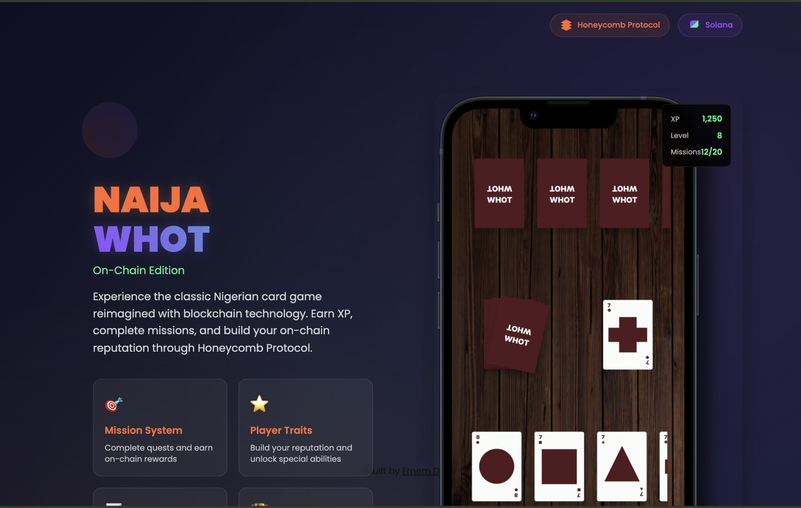

# Dex Naija Whot (Stable Edition) 🎮🏆

<br />



<br />

This is a premium, high-fidelity experience of Naija Whot built for the web. This stable edition includes advanced multiplayer features, tournament management, and a robust "Infinite Market" engine.

Check it out [live here: whot.kwick.ng](https://whot.kwick.ng)

## Key Features 🚀

-   **Real-time Multiplayer**: Challenge friends or play in tournaments with low-latency synchronization.
-   **Tournament Management**: Support for 2, 4, and 8-player bracketed tournaments.
-   **Infinite Market Flow**: Never run out of cards. The game automatically shuffles and replenishes the market from used cards.
-   **Stability & Fairness**:
    -   **Manual Sync**: A "🔄 STUCK? SYNC" button to resolve occasional turn desyncs.
    -   **Connection Watchdog**: Automatically detects and handles hanging connections.
    -   **Server-Side Resolution**: Authoritative winner determination to ensure fair play.
-   **Dynamic UI**: Premium Naija theme with smooth animations and responsive design.

## Technologies ⚙

**Front end:**
-   React & Redux (State Management)
-   Socket.io-client (Real-time communication)
-   React-flip-toolkit (Physics-based animations)
-   Vanilla CSS (Modern, Responsive Design)

**Back end:**
-   Node.js & Express
-   Socket.io (Server-side authority)

## Running the project Locally 🚀

1. **Clone the frontend repository**
   ```bash
   git clone https://github.com/vortex-hue/dex-naija-whot.git
   cd dex-naija-whot
   ```

2. **Install & Run**
   ```bash
   npm install && npm start
   ```

3. **Backend Setup**
   The frontend expects a backend running at the configured socket URL (see `.env` or defaults). You can find the backend repository [here](https://github.com/vortex-hue/dex-naija-whot-backend).

## Contributing 💻

Contributions are welcome! Please feel free to submit Pull Requests or open issues for feature requests and bug reports.

## License 📄

This project is licensed under the MIT License.

